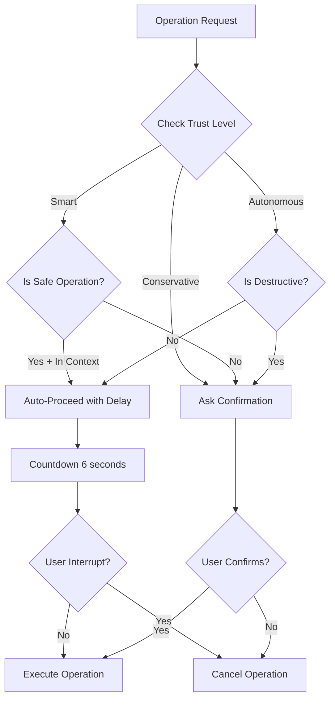

# 🤝 AUTONOMY Method - Trust & Auto-Proceed System

## Overview

The AUTONOMY method defines how Jean Claude manages trust levels and decides when to proceed automatically vs. when to request confirmation.

## Trust Levels

### 🔒 **Conservative Mode**
- **Behavior**: Always asks for confirmation before any write operation
- **Use case**: Critical production environments, learning new codebases
- **Auto-proceed**: Only for read operations
- **Delay**: N/A (always manual)

### 🧠 **Smart Mode** (Default)
- **Behavior**: Auto-proceeds for safe operations in current context
- **Use case**: Regular development, familiar projects
- **Auto-proceed**: Edit, test, format within current task
- **Delay**: 6 seconds (configurable)

### 🚀 **Autonomous Mode**
- **Behavior**: Auto-proceeds for all non-destructive operations
- **Use case**: Trusted environments, repetitive tasks
- **Auto-proceed**: Everything except delete/force operations
- **Delay**: 6 seconds (configurable)

## Operation Classification

### ✅ Safe Operations
Always auto-proceed in smart/autonomous modes:
- `read`, `list`, `status`, `info`
- `analyze`, `check`, `validate`
- `format`, `lint` (non-breaking)

### ⚠️ Moderate Operations
Auto-proceed in autonomous mode, context-dependent in smart mode:
- `edit`, `write`, `create` (files in current task)
- `test`, `build` (local operations)
- `commit`, `branch` (version control)
- `install` (dependencies)

### 🚨 Dangerous Operations
Always require confirmation:
- `delete`, `remove`, `drop`
- `force`, `reset`, `truncate`
- `deploy` to production
- `push` to main/master
- Operations on production resources

## Configuration

### Setting Trust Level
```bash
# Via trust manager
.jeanclaude/lib/trust-manager.sh
source .jeanclaude/lib/trust-manager.sh
set_trust_level "smart" 6

# Via configuration file
cat > .jeanclaude/config/trust.json << EOF
{
  "trust_level": "smart",
  "auto_delay": 6,
  "operations": {
    "safe": ["edit", "read", "test"],
    "moderate": ["commit", "branch"],
    "dangerous": ["delete", "deploy"]
  }
}
EOF
```

### Interactive Configuration
```bash
source .jeanclaude/lib/trust-manager.sh
configure_trust
```

## Usage in Agents

### Example: Smart Edit Decision
```bash
#!/bin/bash
source lib/trust-manager.sh

function edit_file() {
    local file=$1
    local operation="edit"
    
    if requires_confirmation "$operation" "$file" "current_task"; then
        read -p "Edit $file? (y/n): " confirm
        [ "$confirm" != "y" ] && return 1
    else
        auto_proceed "$operation" "$file" "Editing file in current task"
    fi
    
    # Perform edit...
    log_trust_decision "$operation" "proceeded" "safe operation in context"
}
```

### Example: Dangerous Operation
```bash
function delete_directory() {
    local dir=$1
    
    # Always requires confirmation
    echo "⚠️  WARNING: About to delete directory: $dir"
    read -p "Are you sure? Type 'yes' to confirm: " confirm
    
    if [ "$confirm" = "yes" ]; then
        rm -rf "$dir"
        log_trust_decision "delete" "confirmed" "user explicitly confirmed"
    else
        log_trust_decision "delete" "cancelled" "user declined"
    fi
}
```

## Decision Flow



## Context Awareness

The system considers context when making decisions:

1. **Current Task Context**: Files being actively worked on
2. **Project Boundaries**: Operations within project vs. system-wide
3. **Environment**: Development vs. staging vs. production
4. **History**: Previous operations in session

## Logging

All trust decisions are logged for audit:
```
[2025-01-15T10:30:00] [smart] edit: proceeded - safe operation in context
[2025-01-15T10:31:00] [smart] delete: confirmed - user explicitly confirmed
[2025-01-15T10:32:00] [smart] test: auto-proceeded - safe operation
```

## Best Practices

1. **Start Conservative**: Begin new projects in conservative mode
2. **Graduate to Smart**: Move to smart mode once familiar
3. **Autonomous for CI/CD**: Use autonomous mode for automated workflows
4. **Production Rules**: Always require confirmation for production operations
5. **Log Everything**: Maintain audit trail of all decisions

## User Experience

### Smart Mode in Action
```
You: "Fix the typo in README.md"

Claude: ⏱️  Editing README.md in current task
        Auto-proceeding in 6 seconds (press Ctrl+C to cancel)...
        6... 5... 4... 3... 2... 1...
        ✅ Proceeding...
        
[File edited successfully]
```

### Dangerous Operation
```
You: "Delete the old backup folder"

Claude: ⚠️  WARNING: About to delete directory: /backups/old
        This operation cannot be undone.
        Are you sure? Type 'yes' to confirm: _
```

## Customization

Teams can customize operation classifications:
```json
{
  "custom_operations": {
    "safe": ["generate", "preview"],
    "moderate": ["migrate", "sync"],
    "dangerous": ["purge", "reset-db"]
  }
}
```

## Integration with Hooks

Trust decisions can trigger hooks:
```bash
# pre-operation hook
if [ "$TRUST_DECISION" = "auto-proceed" ]; then
    notify-send "Jean Claude" "Auto-proceeding with $OPERATION"
fi
```

## Future Enhancements

- **Learning Mode**: Adapt trust based on user patterns
- **Team Profiles**: Shared trust configurations
- **Risk Scoring**: Dynamic risk assessment per operation
- **Rollback Integration**: Auto-rollback for failed auto-operations